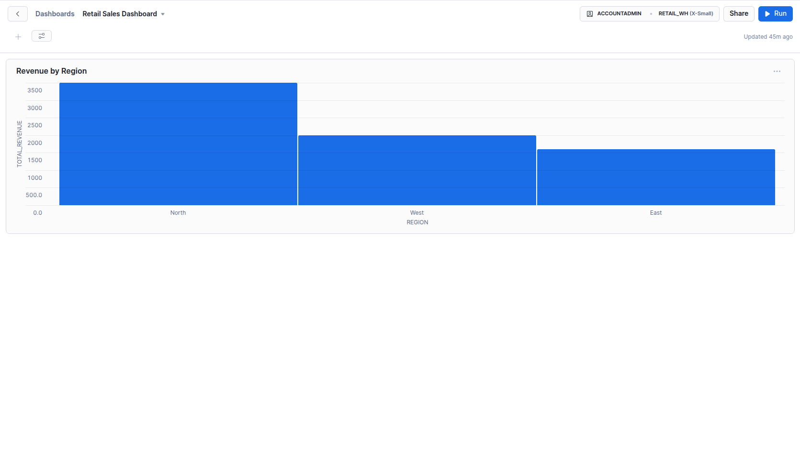

# Snowflake Retail Analytics Platform

## Overview
This project demonstrates an end-to-end retail analytics data warehouse built using Snowflake.

The goal is to ingest raw e-commerce data, transform it using SQL, model it using a star schema, and create analytical queries and dashboards for business insights.

## Tech Stack
- Snowflake (Cloud Data Warehouse)
- SQL
- CSV data sources
- Snowflake Dashboards (Snowsight)

## Architecture
Data flows through the following layers:

CSV Files  
→ RAW tables (source layer)  
→ STAGING tables (cleaned & standardized layer)  
→ ANALYTICS layer (fact & dimension tables)  
→ Dashboards & analytical queries

## Data Model (Star Schema)

Fact Table:
- fact_sales (order-level product sales with revenue)

Dimension Tables:
- dim_customer
- dim_product
- dim_date

## Key Features
- Revenue trend analysis (daily & monthly)
- Top products by revenue
- Revenue by customer region
- Repeat vs new customer analysis
- Average order value (AOV)

## SQL Implementation
All SQL scripts are available in the `sql/` folder:
- RAW table creation
- STAGING transformations
- FACT and DIMENSION tables
- Business analytics queries

## Dashboards
Interactive dashboards were built directly in Snowflake using Snowsight to visualize:
- Daily revenue trends
- Product performance
- Regional revenue distribution

Screenshots can be found in the `dashboard/` folder.

### Dashboard Overview

### Daily Revenue Trend

### Top Products by Revenue

### Revenue by Region

## Skills Demonstrated
- Data warehouse design
- ELT pipeline development
- SQL transformations
- Star schema modeling
- Analytical querying
- Business intelligence reporting

## Author
Aanchal Singh
